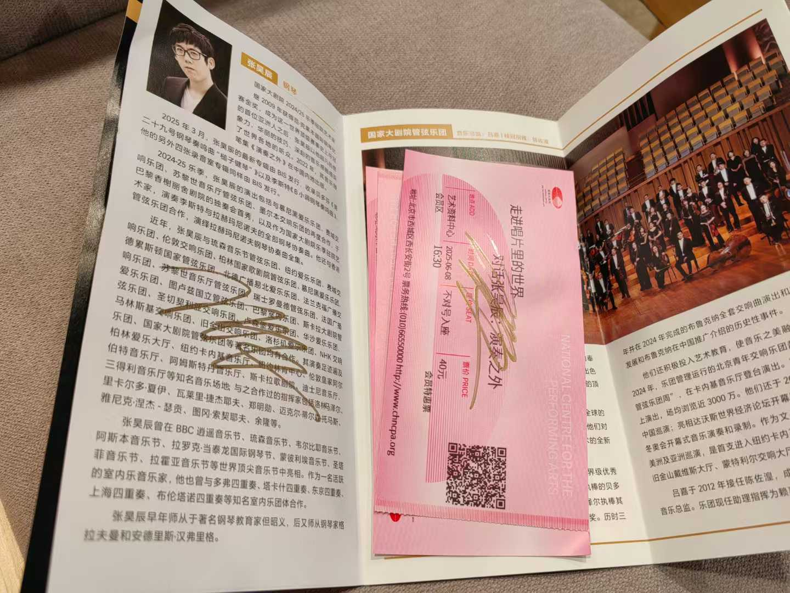
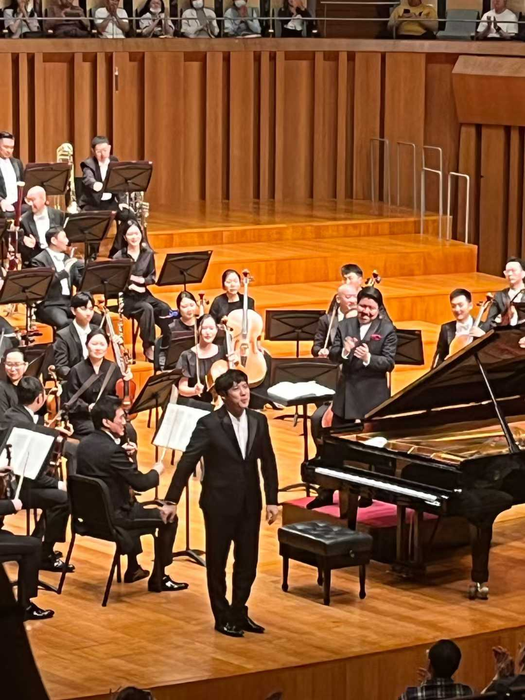

很庆幸这两天经历了这样一场人生体验：张昊辰、黄屹与国家大剧院管弦乐团（蛋交）演绎的拉赫玛尼诺夫钢琴协奏曲全集（和帕格尼尼主题狂想曲），以及演出结束之后的座谈会：“演奏之外”。首先，这是我人生中第一次听这样马拉松式的音乐会。从下午到晚上，除开小跑步去麦当劳吃的晚饭，在音乐厅听了四个多小时（从座谈会上得知，这可能是历史上第五次这样的演出）。

第一场演出的上半场是拉二。巧合的是，我第一次听拉二是2021年初在武汉琴台音乐厅，也是昊辰演奏的，从那以后我深深的爱上了拉二。我总是翻来覆去地听，会在工作、学习的时候听，会在某个刮大风的夜晚听着走回宿舍，会在每年跨年的时候把进度条拖到第二乐章的结尾，庆祝新年的到来。也许是听了太久被电子设备留存、播放的录音，在现场，昊辰和乐团的演奏给了我全新的感受——尤其是第二乐章高潮后的停顿，弦乐再次渐起仿佛自遥远的时空而来，如浪潮般涌动的旋律，让我一下子没能控制住眼泪。下半场是拉一和帕格尼尼主题狂想曲，虽然对曲目没有那么熟悉，但是也有新的感受。拉一的第一乐章让我感到了压抑，第二乐章“明亮又克制”，第三乐章只记得非常有记忆点的旋律了（开头那个）哈哈哈。帕格尼尼主题狂想曲则是小提琴帕24的变奏版本，我最熟悉的大调变奏（镜像）在现场的演奏也十分震撼。

第二场音乐会的上半场是拉四，很遗憾我的审美还在更传统的浪漫乐派。下半场是我最最期待的拉三，其实安排拉三在最后一首就让我很惊讶，这是何等的体力能在演完前面四首曲子之后继续“铲煤”。最后演出更是出乎意料的好，可能是到了马拉松最后一程全力冲刺哈哈哈。第一乐章的大华彩（爽！），非常连贯的第二和第三乐章（无人能拒绝第二乐章结尾和第三乐章开头）（爽！），音色非常美的第二主题（爽！）。总而言之，是一场近乎完美的马拉松。如果一定要挑什么刺，那只能是钢琴和乐团有些地方没对上，可能是因为他们排练时间紧张（后面的座谈会提到真正的排练只有10天）。

在这之后的座谈会，更是完善了这场演出——表演者本人深刻的思考。昊辰说，不应有“天才”这个称呼，“天才”应是常能激起不满的人，艺术创作应该“常常不满”。我不能更认同这个想法了，不只是艺术创作，科研、各行各业的工作都在“不满”中取得进步。昊辰将天赋和努力类比成表演中的音乐和技术，当听众觉得某个音好听的时候，也应当知晓其后的技术。昊辰说，演奏家必须坚持自己的审美，不应被外界影响。然而这很困难，因为我们活在社会里，都会下意识想变成“其他人”。例如人的欲望不是天生就有的，而是社会赋予的。我们应当时刻反思，社会带给了我们什么影响。我们被外界影响是不可控制的，但是可以试图控制、掌握它。昊辰作为演奏家和作者，也讨论了他对文字和音乐的看法。音乐演奏是在重复中锤炼，是生理性的（刻入肌肉记忆哈哈哈）；写书则是给不定性的东西定性，是思想性的。他想要写书，因为音乐是语言，需要被谈论，被形容。

